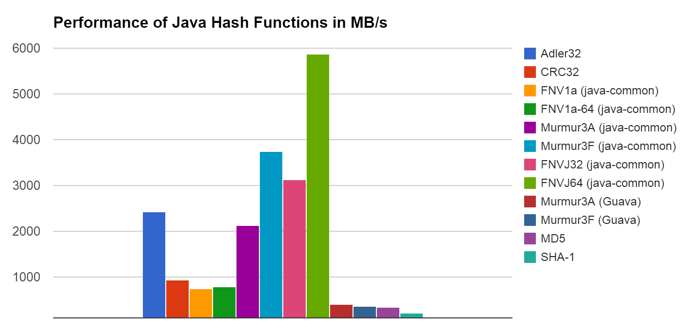
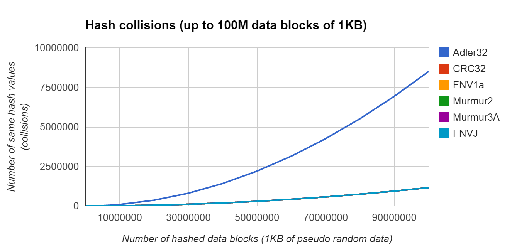

The problem with hash functions for Java
========================================
*Summary:* Core Java APIs lack high quality hash functions, and 3rd party implementations provide sub-optimal performance.

Non-cryptographic hash function are important building blocks of software. The selection of available hash functions is plenty, and in the last decade, many new hash functions emerged with very good hashing properties.

Surprisingly, the core Java API just still offers Adler32 and CRC32, which were designed as checksums many years ago. Of course, there are many hash implementations available outside of the core Java API. Unlike in the C world, there are just a few comparisons available. The hashing algorithms have very different performance characteristics, when the run inside of a Java VM. Today's fastest hashes are highly optimized against CPU hardware, and can perform at several GB/s. The VM layer imposed by Java can get in the way here. Also implementation details matter greatly. For example, Murmur3A can outperform CRC32 by a magnitude when implemented in C. Nevertheless, the same Murmur3A implemented in Java can be several times slower than Java's CRC32 class. These were the results when evaluating Murmur3A from Guava, which is one of the most popular and respected Java libraries available.  

Adler32 and CRC32 provide 32 bit hashes. This is unfortunate because 64 bit hashes are a perfect match for today's 64 bit CPUs and provide much(!) less collisions than their 32 bit counterparts. In contrast to cryptographic hash functions, they are much faster to compute and usually produce smaller hashes that are easy to handle.

So, how do we address these issues?

greenrobot-common hash functions
================================
This project aims improve situation described above by providing:

* Fast Murmur3A (32 bit) and Murmur3F (128 bit) implementations
* FNV-1a implementations for 32 and 64 bit hashes
* Super-fast custom FNVJ hash functions for 32 and 64 bit hashes
* Progressive hash creation useful for streaming or creating the hash step by step (no need accumulate a single byte array)  
* Convenient updateInt/Long/Array/... methods to update the hash   
* Compatibility with java.util.zip.Checksum interface
* Comprehensive test suite to assure correctness (to a certain degree, of course)
* Simple test classes to measure performance and quality of hash functions
* Comparisons of hash functions for Java

The hash functions are available as classes in the de.greenrobot.common.hash package. They implement the [java.util.zip.Checksum](http://docs.oracle.com/javase/8/docs/api/java/util/zip/Checksum.html) interface, and are thus are straight forward to use.

Murmur3 hash functions
----------------------
Murmur3 hash functions are fast and produce high quality hashes. You cannot make a wrong choice here.

Classes: __Murmur3A and Murmur3F__

Speed (i7-3720QM) Murmur3A:  __2130 MB/s__

Speed (i7-3720QM) Murmur3F:  __3752 MB/s__

SMHasher quality: __very good__ (no obvious flaws)

FNV-1a hash functions
---------------------
FNV is a popular hash function and one of the easiest to implement. Our implementation produces the same hashes as the C reference (unit tested). Because of the byte-per-byte algorithm, it's not the fastest on today's processors.      

Classes: __FNV32 and FNV64__

Speed (i7-3720QM) FNV32: __737 MB/s__  

Speed (i7-3720QM) FNV64: __785 MB/s__

SMHasher quality: __mediocre__ (a couple of flaws)

FNVJ hash functions
-------------------
These are some experimental custom hash functions, sacrificing quality to perform very fast. They might be an alternative if your use case does not have strict requirements. When in doubt, stick to Murmur3A or Murmur3F.

Classes: __FNVJ32 and FNVJ64__
 
Speed (i7-3720QM) FNVJ32: __3128 MB/s__  

Speed (i7-3720QM) FNVJ64: __5879 MB/s__
   
SMHasher quality: __bad__ (lots of flaws, only FNVJ32 ported and tested)

Utility classes
---------------
Hash and checksum functions usually only accept bytes as input. Our class PrimitiveDataChecksum transforms shorts, ints, longs, Strings, and arrays on the fly to bytes. It's a wrapper around Java's Checksum interface and can thus be used with all of our hash function classes (or Java's Adler32/CRC32).
 
The class CombinedChecksum takes two Checksum objects (preferably 32 bit) and combines their hashes into a 64 bit hash. CombinedChecksum implements Checksum itself. This class can be useful to work around flaws in hashing functions, or to make collision attacks harder.

Getting hashes on the fly with streaming 
----------------------------------------
Because all hash classes implement Checksum, you can use Java's [CheckedInputStream](http://docs.oracle.com/javase/8/docs/api/java/util/zip/CheckedInputStream.html) and [CheckedOutputStream](http://docs.oracle.com/javase/8/docs/api/java/util/zip/CheckedOutputStream.html). They calculate the checksum (hash) of read/written data on the fly.  

Comparison of hash functions
============================

Our Performance Benchmark
-------------------------
The following charts show the most important results. For details, have a look at the [Java hash function data PDF](web-resources/hash-functions-benchmark.pdf)
 
 
In this test, our Murmur3 implementations perform pretty well. Murmur3F outperforms Java's CRC32 by factor 4 and Guava's implementation of the same hash by factor 10.  

 
Two observations: 1.) Adler32 is outdated (and wasn't designed as a hash). 2.) All other hash functions and the CRC checksum perform equally well with random data.  

 
Each bit in the hash should have a chance of 50% of being 0 or 1. Murmur3A has excellent distribution of bits on the tested random data. It's hard to generalize, however. For different seeds for the pseudo random data, Murmur3A did not always perform best. The main intention of the test is to detect obvious flaws.       

Test platform: Intel® Core™ i7-3720QM (2012), Windows 8 (64 bit), Java 7u72

Other comparisons
-----------------
http://www.strchr.com/hash_functions

http://programmers.stackexchange.com/questions/49550/which-hashing-algorithm-is-best-for-uniqueness-and-speed

http://research.neustar.biz/2012/02/02/choosing-a-good-hash-function-part-3/

http://jpountz.github.io/lz4-java/1.2.0/xxhash-benchmark/

http://blog.reverberate.org/2012/01/state-of-hash-functions-2012.html

http://floodyberry.com/noncryptohashzoo/

Hash function evaluation
------------------------
SMHasher was written by the author of Murmur hash to test various properties of hash functions. It's an excellent tool to detect flaws.

https://code.google.com/p/smhasher/wiki/SMHasher

Misc
====
Other interesting hash functions
--------------------------------
Another simple Murmur3a Java implementation in the public domain: 
http://github.com/yonik/java_util

CityHash can make use of hardware CRC: 
http://en.wikipedia.org/wiki/CityHash and https://code.google.com/p/cityhash/

Hash classics by Bob Jenkins: 
http://en.wikipedia.org/wiki/Jenkins_hash_function

And Bob Jenkins' modern 128-bit SpookyHash: 
http://www.burtleburtle.net/bob/hash/spooky.html

SipHash 64 bits has a secret 128 bit key and claims to be strong against DoS attacks: 
http://en.wikipedia.org/wiki/SipHash

A lesser known hash function claiming to be very fast while maintaining good SMHasher properties:  
https://code.google.com/p/fast-hash/

xxHash claims to be fast for current x86 while having great hashing properties (however, the tested Java version produced lots of hash collisions): 
https://code.google.com/p/xxhash/

Hash function studies
---------------------
"Empirical Evaluation of Hash Functions for Multipoint Measurements", Christian Henke, Carsten Schmoll, Tanja Zseby 
ACM SIGCOMM Computer Communication Review archive Volume 38 Issue 3, July 2008, Pages 39-50 
http://www.sigcomm.org/sites/default/files/ccr/papers/2008/July/1384609-1384614.pdf
